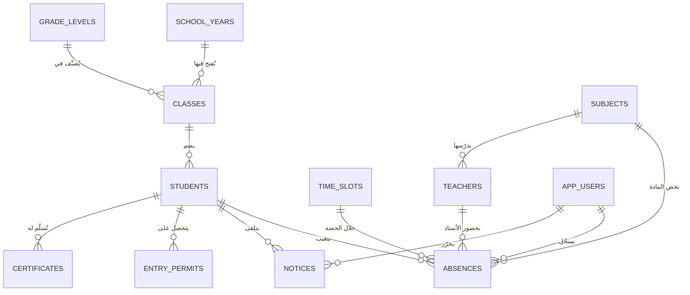

# النموذج المفاهيمي والمنطقي للمعطيات
## Modèle Conceptuel / Logique des Données — méthode MERISE

> هذه الوثيقة تكمل **الفصل الثاني** (الدراسة الأولية) و**الفصل الثالث** (الجانب التطبيقي)
> من مذكرة *تصميم وإنجاز برنامج لمتابعة الغيابات اليومية للتلاميذ*.

---

## 1. قواعد التسيير (Règles de gestion)

| الرقم | القاعدة |
|------|---------|
| RG01 | كل تلميذ ينتمي إلى قسم واحد وواحد فقط في سنة دراسية معينة. |
| RG02 | القسم يضم صفرا أو عدة تلاميذ، وينتمي إلى مستوى واحد وسنة دراسية واحدة. |
| RG03 | اليوم الدراسي مقسم إلى حصص (فترة صباحية وفترة مسائية). |
| RG04 | يسجل الغياب أو التأخر لتلميذ محدد في تاريخ محدد وحصة محددة. |
| RG05 | لا يمكن تسجيل أكثر من حالة واحدة لنفس التلميذ في نفس التاريخ ونفس الحصة. |
| RG06 | كل غياب إما **مبرر** أو **غير مبرر**؛ التبرير يُسجَّل بتاريخه وسببه. |
| RG07 | الحصة ترتبط بمادة واحدة وأستاذ واحد (اختياريا). |
| RG08 | عند بلوغ التلميذ عتبة من الغيابات غير المبررة يُحرَّر له إشعار (أول، ثان، إعذار بالشطب). |
| RG09 | الإشعار يخص تلميذا واحدا، ويمكن أن يحمل مرجعا لإشعار سابق. |
| RG10 | ورقة الدخول تُسلَّم لتلميذ متأخر للسماح له بالالتحاق بالقسم. |
| RG11 | الشهادة المدرسية تُسلَّم لتلميذ برقم تسلسلي فريد وعدد نسخ محدد. |
| RG12 | كل عملية تسجيل تُنسب إلى المستخدم الذي قام بها. |

---

## 2. قاموس المعطيات (Dictionnaire des données)

| الرمز | التسمية | النوع | الطول | الوثيقة المصدر |
|------|---------|------|------|----------------|
| MatriculeNat | رقم التعريف المدرسي | ابجدي/رقمي | 20 | استمارة معلومات التلميذ |
| RegNumber | رقم التسجيل | ابجدي/رقمي | 20 | سجل الدخول والخروج |
| LastName | لقب التلميذ | ابجدي | 40 | استمارة معلومات التلميذ |
| FirstName | اسم التلميذ | ابجدي | 40 | استمارة معلومات التلميذ |
| Gender | الجنس | ابجدي | 10 | استمارة معلومات التلميذ |
| BirthDate | تاريخ الميلاد | تاريخ | 8 | الشهادة المدرسية |
| BirthPlace | مكان الميلاد | ابجدي | 60 | الشهادة المدرسية |
| RegimeStatus | الصفة (خارجي/نصف داخلي/داخلي) | ابجدي | 20 | سجل الدخول والخروج |
| FatherName | اسم الأب | ابجدي | 60 | استمارة معلومات التلميذ |
| MotherName | اسم ولقب الأم | ابجدي | 60 | استمارة معلومات التلميذ |
| SocialStatus | الحالة الاجتماعية | ابجدي | 30 | استمارة معلومات التلميذ |
| SiblingsCount | عدد الإخوة | رقمي | 12 | استمارة معلومات التلميذ |
| SiblingsSchooled | عدد الإخوة المتمدرسين | رقمي | 12 | استمارة معلومات التلميذ |
| GuardianName | الولي | ابجدي | 60 | وثيقة استدعاء الولي |
| GuardianPhone | رقم هاتف الولي | رقمي | 20 | استمارة معلومات التلميذ |
| GuardianEmail | البريد الإلكتروني للولي | ابجدي/رقمي | 60 | استمارة معلومات التلميذ |
| GuardianAddr | العنوان الشخصي للولي | ابجدي | 120 | استمارة معلومات التلميذ |
| ClassName | تسمية القسم | ابجدي/رقمي | 40 | وثيقة غياب التلاميذ |
| LevelName | تسمية المستوى | ابجدي | 40 | التقرير اليومي |
| RoomName | القاعة | ابجدي | 40 | البطاقة الفنية للمؤسسة |
| Capacity | الطاقة الاستيعابية | رقمي | 12 | البطاقة الفنية للمؤسسة |
| YearLabel | السنة الدراسية | ابجدي/رقمي | 20 | كل الوثائق |
| SubjectName | تسمية المادة | ابجدي | 60 | وثيقة غياب التلاميذ |
| Coefficient | المعامل | رقمي | 12 | سجل النتائج المدرسية |
| SlotLabel | تسمية الحصة | ابجدي | 30 | وثيقة غياب التلاميذ |
| DayPart | الفترة (صباحية/مسائية) | ابجدي | 20 | وثيقة غياب التلاميذ |
| StartTime / EndTime | التوقيت | ابجدي | 5 | وثيقة غياب التلاميذ |
| AbsDate | تاريخ الغياب | تاريخ | 8 | سجل الغيابات والتأخرات |
| AbsKind | نوع الحالة (غياب/تأخر) | ابجدي | 20 | سجل الغيابات والتأخرات |
| LateMinutes | دقائق التأخر | رقمي | 12 | سجل الغيابات والتأخرات |
| Justified | مبرر (نعم/لا) | منطقي | 1 | اشعار أول/ثان بالغياب |
| JustifyReason | سبب التبرير | ابجدي | 120 | اشعار أول بالغياب |
| NoticeKind | نوع الإشعار | ابجدي | 30 | اشعار أول/ثان، اعذار بالشطب |
| NoticeNo | رقم الإرسال | ابجدي/رقمي | 20 | اشعار أول بالغياب |
| IssueDate | تاريخ تحرير الوثيقة | تاريخ | 8 | كل الوثائق |
| MeetDate / MeetTime | تاريخ وساعة الحضور | تاريخ/ابجدي | 8/5 | استدعاء الولي |
| NoticeTopic | الموضوع | ابجدي | 150 | اشعار أول بالغياب |
| AbsCount | عدد الغيابات | رقمي | 12 | اشعار ثان بالغياب |
| PermitDate / EntryTime | تاريخ وساعة الدخول | تاريخ/ابجدي | 8/5 | ورقة الدخول |
| CertNo | الرقم التسلسلي للشهادة | رقمي | 12 | سجل الشهادة المدرسية |
| Purpose | الغرض من الشهادة | ابجدي | 100 | الشهادة المدرسية |
| CopiesNo | عدد النسخ | رقمي | 12 | الشهادة المدرسية |
| UserLogin / PassHash | اسم المستخدم وكلمة المرور | ابجدي | 50/64 | (أمن النظام) |

---

## 3. النموذج المفاهيمي للمعطيات (MCD)

### الأفراد (Individus / Entités)

```
SCHOOL_YEAR (YearID, YearLabel, StartDate, EndDate, IsCurrent)
LEVEL       (LevelID, LevelName, SortOrder)
CLASS       (ClassID, ClassName, RoomName, Capacity)
STUDENT     (StudentID, MatriculeNat, RegNumber, LastName, FirstName, Gender,
             BirthDate, BirthPlace, RegimeStatus, FatherName, MotherName,
             SocialStatus, SiblingsCount, SiblingsSchooled, GuardianName,
             GuardianPhone, GuardianEmail, GuardianAddr, EnrollDate,
             ExitDate, IsActive)
SUBJECT     (SubjectID, SubjectName, Coefficient)
TEACHER     (TeacherID, LastName, FirstName, Phone, Email)
TIME_SLOT   (SlotID, SlotLabel, DayPart, StartTime, EndTime, SortOrder)
NOTICE      (NoticeID, NoticeKind, NoticeNo, IssueDate, MeetDate, MeetTime,
             NoticeTopic, AbsCount, Delivered)
PERMIT      (PermitID, PermitDate, EntryTime, Reason)
CERTIFICATE (CertID, CertNo, IssueDate, Purpose, CopiesNo)
APP_USER    (UserID, UserLogin, PassHash, FullName, UserRole, IsActive)
```

### الروابط (Relations) والتعدادات (Cardinalités)

| الرابطة | الأفراد المشاركون | التعدادات | الخصائص |
|---------|------------------|-----------|---------|
| APPARTENIR (ينتمي) | STUDENT – CLASS | (1,1) – (0,n) | — |
| CLASSER (يصنَّف) | CLASS – LEVEL | (1,1) – (0,n) | — |
| OUVRIR (يُفتح في) | CLASS – SCHOOL_YEAR | (1,1) – (0,n) | — |
| **ABSENTER (يتغيب)** | STUDENT – TIME_SLOT | (0,n) – (0,n) | AbsDate, AbsKind, LateMinutes, Justified, JustifyDate, JustifyReason |
| CONCERNER (تخص) | ABSENCE – SUBJECT | (0,1) – (0,n) | — |
| ASSURER (يؤمِّن) | ABSENCE – TEACHER | (0,1) – (0,n) | — |
| ENSEIGNER (يدرّس) | TEACHER – SUBJECT | (1,1) – (0,n) | — |
| RECEVOIR (يتلقى) | STUDENT – NOTICE | (0,n) – (1,1) | — |
| OBTENIR (يتحصل على) | STUDENT – PERMIT | (0,n) – (1,1) | — |
| DELIVRER (تُسلَّم له) | STUDENT – CERTIFICATE | (0,n) – (1,1) | — |
| SAISIR (يُسجِّل) | APP_USER – ABSENCE | (0,n) – (1,1) | RecordedAt |

> **ملاحظة أساسية :** الرابطة `ABSENTER` من النوع **(n,n)** بين `STUDENT` و `TIME_SLOT`
> وتحمل خصائص، لذا تتحول — حسب قواعد الانتقال — إلى جدول مستقل هو `Absences`
> مفتاحه مركب منطقيا من (StudentID, AbsDate, SlotID).

### مخطط الكيانات والعلاقات



---

## 4. قواعد الانتقال من MCD إلى MLD

| القاعدة | التطبيق في هذا المشروع |
|---------|------------------------|
| كل فرد يصبح جدولا، ومميزه يصبح مفتاحا أساسيا | `STUDENT → Students(StudentID)` … |
| خصائص الفرد تصبح حقولا للجدول | `LastName, FirstName, …` |
| رابطة (1,n) : المفتاح الأساسي للفرد ذي التعداد (0,n) ينتقل مفتاحا ثانويا للفرد ذي التعداد (1,1) | `Classes.ClassID → Students.ClassID` |
| رابطة (n,n) : تصبح جدولا مستقلا، مفاتيح الأفراد تصبح مفاتيحه، وخصائص الرابطة تصبح حقولا له | `ABSENTER → Absences(StudentID, SlotID, AbsDate, …)` |

---

## 5. النموذج المنطقي للمعطيات (MLD)

```
SchoolYears  (#YearID, YearLabel, StartDate, EndDate, IsCurrent)

GradeLevels  (#LevelID, LevelName, SortOrder)

Classes      (#ClassID, ClassName, RoomName, Capacity,
              LevelID*  → GradeLevels,
              YearID*   → SchoolYears)

Students     (#StudentID, MatriculeNat, RegNumber, LastName, FirstName, Gender,
              BirthDate, BirthPlace, RegimeStatus, FatherName, MotherName,
              SocialStatus, SiblingsCount, SiblingsSchooled, GuardianName,
              GuardianPhone, GuardianEmail, GuardianAddr, EnrollDate, ExitDate,
              IsActive, PhotoPath, Notes,
              ClassID*  → Classes)

Subjects     (#SubjectID, SubjectName, Coefficient)

Teachers     (#TeacherID, LastName, FirstName, Phone, Email,
              SubjectID* → Subjects)

TimeSlots    (#SlotID, SlotLabel, DayPart, StartTime, EndTime, SortOrder)

Absences     (#AbsenceID, AbsDate, AbsKind, LateMinutes, Justified,
              JustifyDate, JustifyReason, RecordedAt, Notes,
              StudentID* → Students,
              SlotID*    → TimeSlots,
              SubjectID* → Subjects,
              TeacherID* → Teachers,
              RecordedBy*→ AppUsers)
              -- قيد الوحدانية : UNIQUE (StudentID, AbsDate, SlotID)

Notices      (#NoticeID, NoticeKind, NoticeNo, IssueDate, MeetDate, MeetTime,
              NoticeTopic, AbsCount, Delivered, Notes, RefNoticeID,
              StudentID* → Students,
              IssuedBy*  → AppUsers)

EntryPermits (#PermitID, PermitDate, EntryTime, Reason,
              StudentID* → Students,
              IssuedBy*  → AppUsers)

Certificates (#CertID, CertNo, IssueDate, Purpose, CopiesNo,
              StudentID* → Students,
              YearID*    → SchoolYears,
              IssuedBy*  → AppUsers)

AppUsers     (#UserID, UserLogin, PassHash, FullName, UserRole, IsActive, CreatedAt)

AppSettings  (#SettingKey, SettingValue)
```

**الرموز :** `#` مفتاح أساسي (clé primaire) — `*` مفتاح ثانوي (clé étrangère).

عدد الجداول : **13 جدولا**. الترجمة الفعلية بلغة SQL موجودة في
`Database/01_CreateTables.sql` وفي الوحدة `Source/uDB.pas`.
